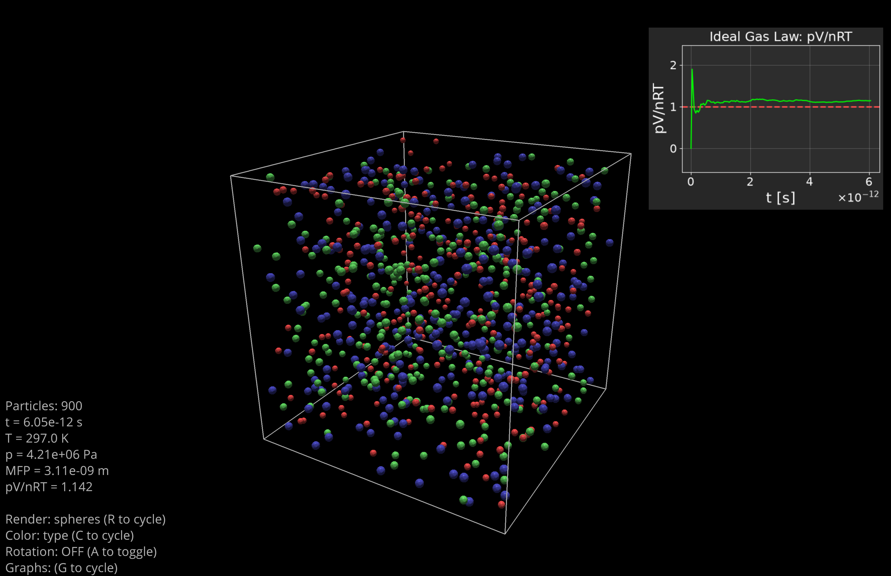
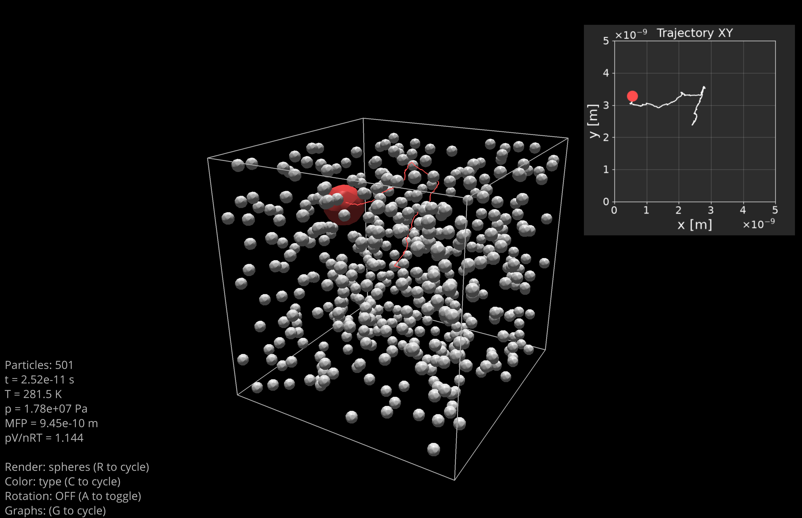
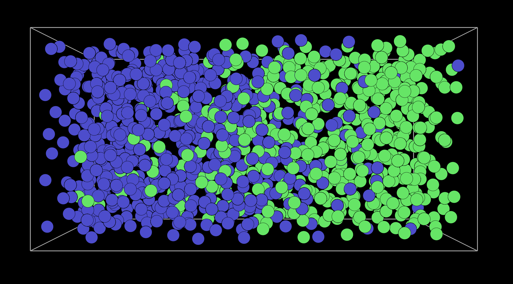
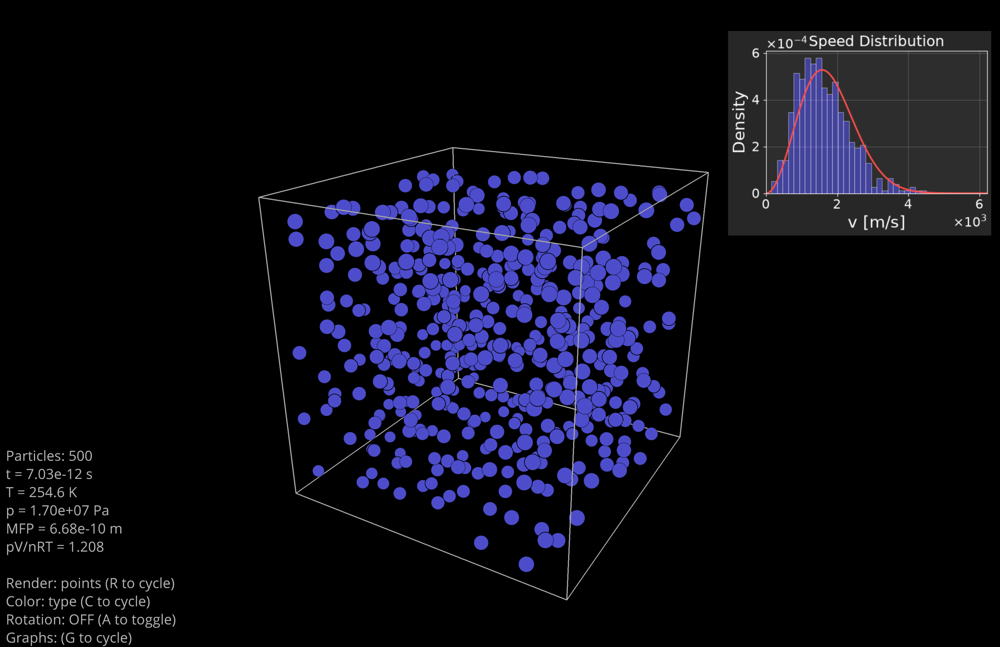
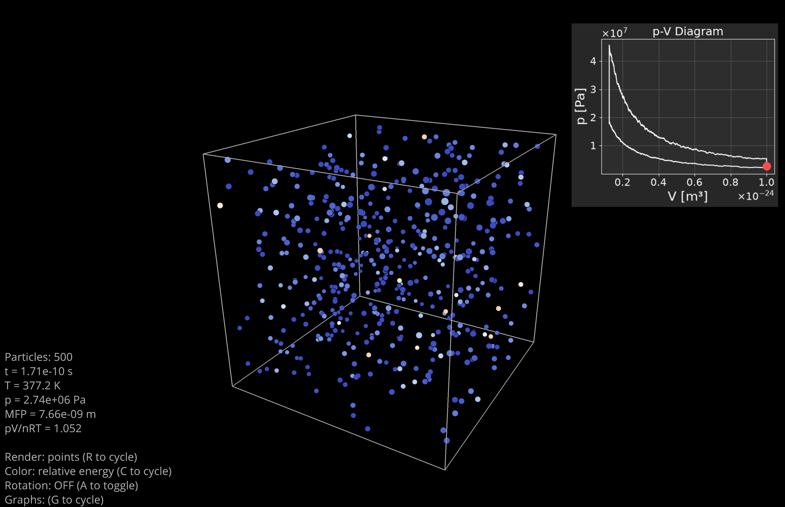
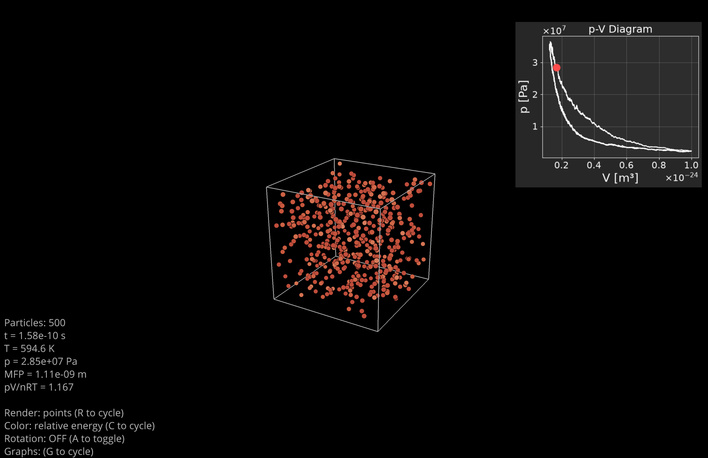

# 3D Gas Simulation



> **Note**: AI was used occasionally during the development of this project, but not to build it entirely. This README was automatically generated by AI.

## Description

3D ideal gas simulation with real-time visualization. The project simulates particle behavior in a container using elastic collision physics and allows visualization of various thermodynamic phenomena.

## Features

- **Realistic physics simulation**: elastic particle-particle and particle-wall collisions, Berendsen thermostat, piston compression/expansion
- **Interactive 3D visualization**: real-time rendering with VisPy, automatic camera rotation, particle trajectory tracking
- **Thermodynamic cycles**: Carnot and Stirling cycles with real-time p-V diagrams
- **Video export**: MP4 video generation of simulations
- **Overlay charts**: velocity histograms, ideal gas law verification, p-V diagrams

## Installation

```bash
# Create virtual environment
python3 -m venv gasenv
source gasenv/bin/activate

# Install dependencies
pip install numpy matplotlib vispy PyQt5 imageio imageio-ffmpeg
```

## Usage

Each scenario can be launched in live visualization mode or video export mode:

```bash
# Activate environment
source gasenv/bin/activate

# Launch a scenario in live mode
python src/scenarios/ideal_gas.py

# Export as video
python src/scenarios/ideal_gas.py --video
```

## Available Scenarios

| Scenario | Description |
|----------|-------------|
| `ideal_gas.py` | Verification of the ideal gas law pV = nRT |
| `brownian_motion.py` | Brownian motion of a large particle |
| `gas_mixing.py` | Mixing of two gases |
| `heat_diffusion.py` | Thermal diffusion between two compartments |
| `joule_expansion.py` | Joule-Thomson expansion |
| `stirling_cycle.py` | Stirling cycle |
| `carnot_cycle.py` | Carnot cycle |
| `stirling_cycle_slow.py` | Quasi-static Stirling cycle |
| `carnot_cycle_slow.py` | Quasi-static Carnot cycle |
| `weird_velocities.py` | Maxwell-Boltzmann distribution |

## Keyboard Controls

| Key | Action |
|-----|--------|
| `Space` | Pause/Resume |
| `A` | Toggle automatic rotation |
| `G` | Cycle chart display (normal/expanded/hidden) |
| `R` | Cycle render mode (spheres/points) |
| `C` | Change color palette |
| `I` | Show/Hide info overlay |
| `+` | Increase simulation speed |
| `-` | Decrease simulation speed |
| `Escape` | Quit |
| `Click` | Display particle trajectory |

## Configuration

### Color Modes

Particle colors can be set via `RendererConfig(color_mode=...)`:

| Mode | Description |
|------|-------------|
| `by_type` | Each particle type has its own color |
| `by_energy` | Color based on kinetic energy (absolute scale) |
| `by_relative_energy` | Color based on kinetic energy of particles compared to the average |
| `by_speed` | Color based on velocity magnitude |

## Physical Modeling

### Units and Scales

All calculations use SI units:
- **Length**: meters (typical container size: ~10 nm = 10⁻⁸ m)
- **Mass**: kilograms (H₂ molecule: ~3.3×10⁻²⁷ kg)
- **Time**: seconds (typical timestep: ~10⁻¹⁴ s)
- **Temperature**: Kelvin
- **Pressure**: Pascals

Particle radii use Van der Waals radii (e.g., H₂: 1.2 Å, N₂: 1.55 Å).

### Time Scaling

The simulation runs at the nanosecond scale, but displays in real-time seconds. The `time_ratio` property controls this mapping:

```
display_time = simulation_time / time_ratio
```

With the default `time_ratio = 1e-12`, one second of display corresponds to 1 picosecond of simulation. Adjust this to speed up or slow down the visualization relative to the physics.

### Time Integration

Particle positions are updated using explicit Euler integration:
```
position(t + dt) = position(t) + velocity(t) × dt
```

The timestep is adaptive, computed from a CFL condition to ensure particles don't travel more than a fraction of a cell per step.

### Particle-Particle Collisions

Elastic collisions between two particles conserve momentum and kinetic energy:
```
v₁' = v₁ - (2m₂/(m₁+m₂)) × (v_rel · n) × n
v₂' = v₂ + (2m₁/(m₁+m₂)) × (v_rel · n) × n
```
where `n` is the unit vector along the collision axis and `v_rel = v₁ - v₂`.

Collision detection uses a spatial grid to efficiently find nearby particle pairs.

### Wall Collisions and Piston

Fixed walls (at origin) use simple reflection:
```
v' = -v  (component perpendicular to wall)
```

Moving walls (piston) use elastic collision with a moving surface:
```
v' = 2 × v_piston - v
```

The impulse transferred to the wall is recorded for pressure calculation:
```
impulse = 2m|v_rel|
```

### Pressure Calculation

Pressure is computed from the total impulse transferred to the walls over a rolling time window:
```
P = total_impulse / (Δt × A)
```
where `A` is the wall surface area.

The `pressure_window` parameter in `Config` controls the size of this rolling window (number of simulation steps). A larger window gives smoother pressure readings but introduces more lag. Typical values:
- `80-100`: responsive, some noise (good for fast cycles)
- `200-400`: smooth readings (good for slow/quasi-static processes)

### Thermostat

The Berendsen thermostat rescales velocities at each timestep to drive the system toward a target temperature:
```
λ = sqrt(1 + (T_target/T_current - 1) × dt/τ)
v' = λ × v
```
where `τ` is the coupling time constant.

### Position Scaling During Compression

When the container is compressed or expanded, particle positions are scaled relative to the origin (fixed wall) to keep them inside:
```
position' = position × (new_size / old_size)
```

## Customization

### Available Transformations

The `Transformations` class (accessible via `simulation.transformations`) provides methods to modify the system:

| Method | Description |
|--------|-------------|
| `add_thermostat(T, tau, duration)` | Add a Berendsen thermostat to regulate temperature |
| `apply_instantaneous_thermostat(T)` | Instantly rescale velocities to target temperature |
| `set_deformation(dims_i, dims_f, duration)` | Resize container (adiabatic if no thermostat) |
| `set_isothermal_deformation(...)` | Resize container while maintaining temperature |
| `set_adiabatic_deformation(...)` | Resize container following adiabatic curve (TV^γ-1 = const) |
| `add_waiting_action(duration, callback)` | Execute a callback after a delay |
| `stirling_cycle(...)` | Run a complete Stirling cycle |
| `carnot_cycle(...)` | Run a complete Carnot cycle |

### Creating a Custom Scenario

Create a new file in `src/scenarios/` that extends `Scenario`:

```python
from src.simulation.scenario import Scenario
from src.simulation import Simulation
from src.utils import Config, PARTICLE_PRESETS

class MyScenario(Scenario):

    @property
    def name(self) -> str:
        return "my_scenario"

    def setup_system(self):
        config = Config(lx=10e-9, ly=10e-9, lz=10e-9)
        sim = Simulation(config)
        sim.add_particles(
            particle_type=PARTICLE_PRESETS["N2"],
            count=500,
            temperature=300,
        )
        renderer = Renderer(simulation=sim)
        return sim, renderer

    def run(self):
        # Add transformations, thermostats, etc.
        pass

if __name__ == "__main__":
    scenario = MyScenario()
    args = scenario.parse_args()
    if args.video:
        scenario.launch_video_exporter()
    else:
        scenario.launch_live_viewer()
```

### Adding a Custom Chart

Create a class that extends `Chart`:

```python
from src.visualization.chart_overlay import Chart, ChartOverlay, ChartConfig

class MyChart(Chart):

    def __init__(self):
        super().__init__(title="My Chart")
        self.data = []

    def update(self, simulation):
        # Called each frame, collect data
        self.data.append(simulation.thermodynamics_state.temperature)

    def draw(self, ax, scale=1.0):
        # Draw using matplotlib
        ax.plot(self.data, color='white')
        ax.set_ylabel("T [K]", color='white')
```

Then add it in your scenario's `setup_charts()` method:

```python
def setup_charts(self):
    overlay = ChartOverlay(config=ChartConfig(position="top-right"))
    overlay.add_chart(MyChart())
    return overlay
```

### Customizing Video Export

Video export is configured via `VideoConfig`. Override the `video_config` property in your scenario:

```python
@property
def video_config(self) -> VideoConfig:
    return VideoConfig(
        output_path=Path("my_video.mp4"),
        fps=60,              # Frames per second
        duration=30.0,       # Video duration in seconds
        resolution=(1920, 1088),
        codec="libx264",
        quality=8            # Higher = better quality
    )
```

## Limitations and Performance

### Performance

- **Recommended particle count**: 200-1000 particles for smooth real-time visualization
- **Upper limit**: ~2000 particles before performance degrades significantly
- Collision detection uses O(n) spatial hashing

### Known Limitations

The simulation makes several simplifying assumptions:

- **Point-like particles**: No molecular rotation or vibration modes (monoatomic approximation)
- **No intermolecular forces**: No Van der Waals attraction, only hard-sphere collisions
- **Ideal gas behavior**: No phase transitions, no real gas corrections
- **Cubic container only**: Walls are axis-aligned planes
- **Adiabatic processes use γ = 5/3**: Forced to follow theoretical curve via thermostat (not emergent)

## Project Structure

```
src/
├── simulation/      # Simulation engine (physics, gas, container)
├── visualization/   # 3D rendering, video export, charts
├── scenarios/       # Demo scenarios
└── utils.py         # Constants and particle types
```

## Screenshots

### Brownian Motion


### Gas Mixing


### Maxwell-Boltzmann Distribution


### Stirling Cycle


### Carnot Cycle


## License

MIT License
